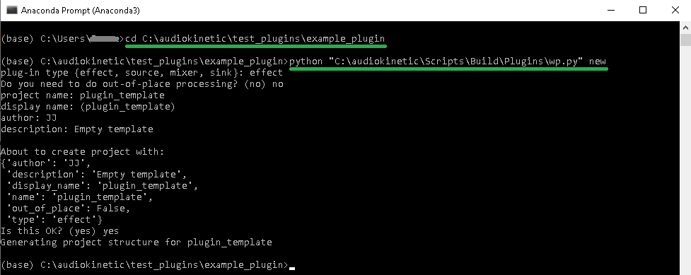
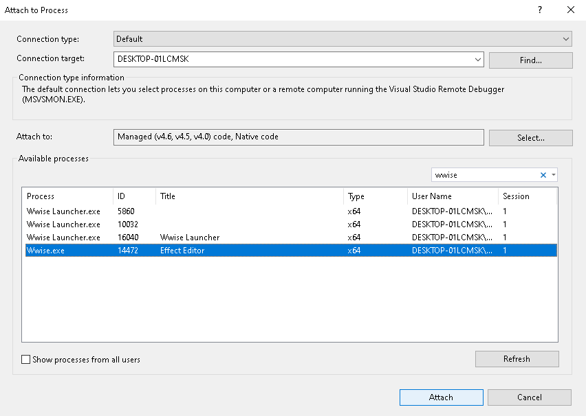

# Wwise Plugin tutorial 

This tutorial shows how to set up Wwise SDK and the required build tools to build a Wwise plugin for Windows. The plugin can be used in Wwise authoring or in Wwise-Unity integration (the latter isn't covered fully in depth but should be enough to get started if you know Unity and Wwise). 

The actual plugin doesn't do anything but can be used as a template or a "hello world" type of test to learn the development tool environment and the workflow. This is meant to get a plugin built and up and running quickly. There doesn't seem to be a lot of material covering the workflow step-by-step so hopefully this will be useful for someone. For actual development and customization to your use case and platform, please refer to Wwise SDK documentation:

https://www.audiokinetic.com/library/edge/?source=SDK&id=goingfurther_newplugins.html

The workflow in this tutorial is based on using the effect development tools included with the Wwise SDK:

https://www.audiokinetic.com/library/edge/?source=SDK&id=effectplugin_tools.html

## The Required tools

The things you need to get started are:

**Python 2** or **3** installation. You don't need to write any Python code, but the installation is required to run the build scripts via the Command Prompt. For this tutorial the Python in use was an Anaconda installation. Anaconda might be a bit overkill if you don't use Python for anything else (but is also handy if you are doing the next part of the tutorial). Miniconda is a bit more compact option or use the basic Python installation from the link below if you don't already have it installed (to check, just open Command Prompt, type *python* and press enter. If the version number is output you already have it ready for use):

https://www.python.org/downloads/

**Microsoft Visual Studio 2017** or **2019 Community** (yes you need it, the Wwise developmet tools create solution files for Visual Studio): 

https://visualstudio.microsoft.com/downloads/

(When installed, or even if you already had Visual Studio already installed, check that in *Tools → Get tools and features → Desktop development with C++*, the *ATL and MFC build tools* are installed.
Otherwise you may get "missing afxwin.h error" when building the plugins later. Adding ATL and MFC should fix it.)

**Wwise**:
Download the **Wwise Launcher** and by using it install *Wwise v.2019.2.4.7329*, *Wwise SDK*, *Unity-Wwise Integration* and the support for target platforms you require (Win, Mac, Android etc..You can build for other platforms from Windows).This tutorial is directly applicable to Windows only, but should not differ that much for the other platforms (at least Mac/Linux as the development platform. I think the main difference is the file types created by the build scripts)

https://www.audiokinetic.com/download/

**IMPORTANT WHEN INSTALLING WWISE**:
*"Caution: When installing the Wwise SDK from the Launcher select all target platforms and ensure there are no spaces in the installation path. "*

So the install path should be something like *C:\audiokinetic\*. This is what this tutorial uses as the file path in the examples, modify to suit your installation path if different. Choose a location with spaces at your own risk.

## Creating a new plugin

This repository has the code included for reference but don't download it. The following steps create the same code on your computer.

To create a new plugin use the Wwise development tools located in the following folder of the SDK:

C:\audiokinetic\Scripts\Build\Plugins\ 

It contains various Python scripts that can be run by giving parameters to the main script *"wp. py"*.

There are various types of plugins that can be created, this tutorial is about creating an *effect* type of plugin.

The script is executed from the command line. It depends a bit on your Python installation; If Python path is accessible from your regular Command Prompt you can use it, but on this tutorial they are run from Anaconda Prompt. Use what works for you. If the regular Command Prompt just runs the scripts without any output information, it means it is not really premaking or building anything. If that happens troubleshoot your Python installation path or try VS Native Tools Command Prompt or others that are available on your system.

Open the chosen Command Prompt and change directory to a folder where you want your plugin to be created using the *cd* command. Here the folder is C:\audiokinetic\test_plugins. When you have changed directory to that folder, run the command: 

    python "C:\audiokinetic\Scripts\Build\Plugins\wp.py" new 

and answer the prompts as below:

The following file structure has now been created:

Change directory to the newly created folder using the cd command:

    cd C:\audiokinetic\test_plugins\example_plugin\plugin_template

## Premaking

You can now use the the development tools to Premake the Visual Studio *.sln* solution files for the projects. 

Run the following commands in that folder (*Windows_vc160* input argument for VS 2019):

    python "C:\audiokinetic\Scripts\Build\Plugins\wp.py" premake Authoring
    python "C:\audiokinetic\Scripts\Build\Plugins\wp.py" premake Windows_vc160

You see the solution files created by these commands below. There are three different types of solution files: *Authoring*, *static* and *shared*. Authoring command builds the Authoring version and Windows_vc160 builds static and shared.

They are created for three different Visual Studio versions. This tutorial uses *VS 2019* so the solution files to use have the *Windows_vc160* identifier on them ( Windows_vc140 is for VS 2015 and  Windows_vc150 for VS2017 so use them if you use an earlier version of Visual Studio). 

*SoundEnginePlugin* folder has the files and projects used by *shared* and *static* libraries (no GUI, used within the sound engine). WwisePlugin folder has the files and projects for the Authoring side of the plugin (has GUI, used by the Wwise authoring application). You can customize and control what is included in each of these three separate projects by modifying the *PremakePlugin.lua* script included in the root folder. What you need depends on your use case and platform (f.e. Unity and Unreal require different setups) but it is out of the scope of this tutorial. Please refer to the SDK documentation for that. It is really required to spend some time reading through it and doing tests, there's no easy way around it if you are making a custom build.

The solution files could now be opened, and starting to code the processing loop and parameter handling would be possible from this point, but it is good to actually first build the plugins and test them in Wwise and Wwise Unity Integration to learn the workflow. You then know what you should expect on each stage.

## Building the plugins

The plugins are built by running the following commands:

    python "C:\audiokinetic\Scripts\Build\Plugins\wp.py" build Authoring -c Release -x x64_vc160
    python "C:\audiokinetic\Scripts\Build\Plugins\wp.py" build Windows_vc160 -c Debug

The first command builds a *release* version of *Authoring* and the second builds *debug* versions of *shared* and *static* libraries. This seems to be the combination to use if there needs to be some debugging to be done using breakpoints. Although built as release version, you can still debug authoring side code as long as the .pdb symbols are there and loaded by Visual Studio.

Running the commands results in the files built in the following locations:

Wwise already knows to look for plugins in these folders (all the other installed plugins are located in these as well), so you can now open Wwise via the Wwise Launcher (Wwise -> "Open Wwise"), create a new blank project, click "Master Audio Bus"-> effects.  "plugin_template" should now be selectable in the drop down menu. Select it and choose "new". Now you can click next to the "ID" to see a GUI with a dummy slider.

Download and add the *wwisetestwav.wav* file (included in the project root folder) to the project (Right-click Default Work Unit" and select "Import Audio Files") and set it to loop by ticking the "Looping" box accessible in it's *general settings* tab. It is helpful to have it looping for testing. A lot of the behaviour depends on if the sound is playing or not, and contrary to regular multitrack audio DAW software, Wwise actually destroys the plugin instance when the sound stops if the plugin is attached directly to a sound. They should rather mainly be added to buses. This is good to keep in mind when testing as it can be confusing at first.

## Debugging

Then to debug the plugin, open the *plugin_template_Authoring_Windows_vc160.sln* in Visual Studio.

First add the symbol paths (where the debug symbol .pdb files are located) to your Visual Studio solution in *Tools -> Options -> Symbols*. Of course use filepaths specific for your setup. 

While Wwise is running and the plugin is in use as set in the previous step, in Visual Studio go to *Debug -> Attach to process*. See that the "Attach to:" option is as in the picture. Search for Wwise in the search bar and select the Wwise.exe option as below and click "Attach":

Then in Visual Studio, add the breakpoint to the following place in the *plugin_templateFXParams.cpp* file. Now click on *wwisetestfile* and press play in Wwise and then move the dummy slider. The breakpoint should now be hit.

However, if trying to set a breakpoint to the actual main DSP processing loop at plugin_templateFX.cpp it shows up as a inactive and blanked out breakpoint:

The solve this, add the following lines before and after the Execute loop as pictured (of course remove these for release or profiling versions when you're done with the development):

    #pragma optimize("", off)
    #pragma optimize("", on)

Now run all the premake and build commands again (you need to do this after every code change), open the Wwise project again, in VS select *Debug -> Reattach to process* and add the break point to some line in the Execute loop. When again pressing play in Wwise with *wwisetestwav* selected, the breakpoint should now be hit.

That is the basic way to create, premake, build and debug a empty Wwise plugin (Authoring, static and shared) on Windows.

## Wwise Unity integration

To customize and use the plugin in Wwise Unity Integration, please refer to this documentation for details:

https://www.audiokinetic.com/library/edge/?source=Unity&id=index.html

The following gives an overview of the required steps and assumes some familiarity with Unity an Wwise. It gives the main steps and may contain errors, you might need to adjust to suit your setup either in Wwise or Unity interfaces.

First install Unity if you don't already have it (this tutorial uses "Personal" version 2019.2.19)

https://store.unity.com/#plans-individual

Use Unity Hub to create a new Unity project with some generic game object in it, for example a sphere. Save and close Unity.

Since the plugin_template isn't actually doing anything to the sound, it is maybe best to first practice the integration workflow with some easily noticeable effect such as the Wwise Delay plugin. So replace the *plugin_template* plugin that was previously inserted to Master Bus with the Delay so you clearly hear when it is processing sound. Double-click Master Audio Bus and delete and replace the plugin. Then select the *wwisetestwav* audio test file located in the root folder and press play to confirm you hear the delay effect.

https://www.audiokinetic.com/fr/library/edge/?source=Unity&id=pg_installvalidation.html

Create a new event to play the *wwisetestwav*

Now click F7 to open SoundBank Manager. Click "New" and name your soundbank.

Drag the event to the soundbank (green arrow in the picture). Now it is included in the soundbank (green underlining in the picture).

Now in Project Explorer go to the SoundBanks tab and right-click the Default Work Unit and select "Generate Soundbank(s) for all platforms".

Next, integrate the project using Wwise Launcher:

Choose the desired platforms and the correct SDK version and project location and click Integrate. This takes a while but soon there should be a "Operation completed successfully" message.

Open up the Unity project using Unity Hub.

Now drag the soundbank and the event from the Wwise Picker window to the sphere object.

They should show up in the Unity Inspector window (on the right by default) and pressing play on the event should result in playback with the added delay effect.

When that is working, try the same with your own plugin. It should not be yet necessary to package and bundle the plugin for testing with the Wwise Development tools (see the tools documentation). Those steps only need to be done if you want to distribute the plugin and have the user to install it via the launcher. For development stage it is enough to copy it by hand.

Basically once the plugin is ready to be tested in the integration (first create, premake, code and build a plugin as was done in the previous steps of this tutorial). Then you manually copy the shared .dll (and .pdb debug symbols if you wish) to the Unity integration folder (\Assets...)

C:\unity_projects\integration_example\Assets\Wwise\Deployment\Plugins\Windows\x86_64\DSP

Then use the created plugin in a Wwise project, generate the soundbanks for the project. Use Wwise launcher to create (or modify) the Unity integration and finally open the Unity project with integration for testing as before.

More details how to use the integration:

https://www.audiokinetic.com/library/edge/?source=Unity&id=pg_appscripts.html

# Do's and dont's

**Do** give your plugin a unique ID if you are testing with multiple different plugins even if they are differently named. It is easy to forget some old library builds with .xlm files to the various folders with overlapping IDs if you don't modify the default IDs. This will cause erratic beaviour that can be hard to pinpoint. The plugin ID should be unique and must be kept in sync in the following files:

    /WwisePlugin/plugin_template.xml
    /plugin_templateConfig.h
    /FactoryAssets/Manifest.xml

**Don't** use many build settings during development as it is hard to keep track of what has been built and where. You may end up with some builds in some folders that get loaded and used by some setup that are not in sync with the code in your current project. This also can cause erratic behaviour as above with clashing plugin IDs. 

For example if you try building Authoring as Debug and Release versions while making some changes somewhere in the code or settings in between the builds, or if you use different VS solution files or projects aimed at different platforms, make a different project with unique name and unique ID. 

Use for example only one set of command parameter per project until you really know what is going on, for example as used before in this tutorial:

    python "C:\audiokinetic\Scripts\Build\Plugins\wp.py" premake Authoring
    python "C:\audiokinetic\Scripts\Build\Plugins\wp.py" premake Windows_vc160

    python "C:\audiokinetic\Scripts\Build\Plugins\wp.py" build Authoring -c Release -x x64_vc160
    python "C:\audiokinetic\Scripts\Build\Plugins\wp.py" build Windows_vc160 -c Debug 

If you use change the command parameters while working on your project (like from Release to Debug or premake Windows_vc160 to premake Windows_vc150...) you should start fresh and manually clean everything up in the build folders (Authoring shared and static for each development platform, debug and release and each Visual Studio solution/toolset, Windows 32/64bit etc.).

# Final note

The Wwise SDK documentation is both very complex and minimalistic&ambiguous at the same time. It is very time consuming to learn what is really happening. Spending a day or two just playing around with the setup and a template plugin to learn the workflow will save you time and frustration in the end. 

There is a lot to keep in sync and take care of in the code level (writing and loading soundbank data, memory management, parameter handling, developer and plugin IDs, linking for different plugins and use situations...)  so it is essential to learn the details of your use case and platform setup thoroughly first.

For some of this, you can see the other tutorial in this repository about experiments on how to integrate Spatial Audio Framework (SAF) to Wwise. It is not fully working or complete but can give some ideas for the next steps. You still need to read through the SDK.

https://www.audiokinetic.com/library/edge/?source=SDK&id=goingfurther_newplugins.html

 
